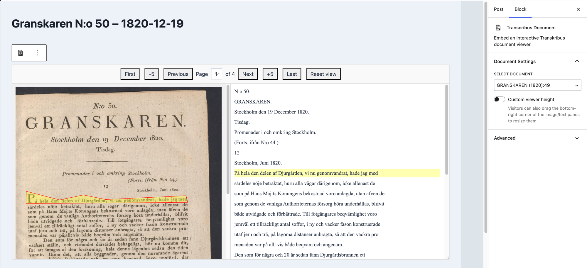

# Transcribus Viewer for WordPress

Uploads Transkribus exports (ZIP) and displays them in an interactive, line-by-line viewer.

This plugin provides a full-featured system for importing Transkribus documents into WordPress. It creates a `transkribus_document` post type, includes an async background uploader, and provides two ways to display the viewer:

1. Directly on the document's own page.
2. Embedded in any post or page using a custom "Transcribus Document" Gutenberg block.

The viewer displays the document's description followed by the interactive image and text panes, kept in sync as you navigate, zoom, pan, or resize.

## This is what you get

## Installation

1. Upload the `transcribus-viewer-for-wordpress` folder to your `/wp-content/plugins/` directory.
2. Install the 'Action Scheduler' library in `/includes/lib/`.
3. In the plugin's root folder, run `npm install` and then `npm run build` to build the Gutenberg block assets.
4. Activate the plugin through the 'Plugins' menu in WordPress.
5. Navigate to "Transkribus Docs" > "User Guide" for next steps.

See [`readme.txt`](readme.txt) for the full changelog and WordPress.org-style plugin metadata.
